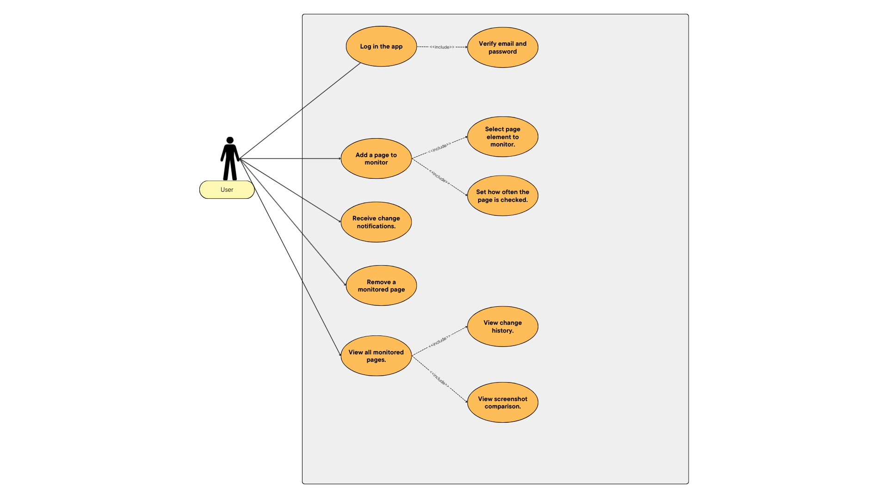

# Website Change Monitor

## 1. Project Description

The **Website Change Monitor** is a command-line application developed in Go, designed to periodically analyze the content of specified webpages and detect updates. The system enables users to register webpages for monitoring, define the HTML elements of interest through CSS selectors, configure checking intervals, and receive notifications when relevant changes are identified.

The project integrates essential concepts such as web scraping, scheduling of automated tasks, hashing and change detection, storage of historical data, and basic CLI-based user interaction. The purpose of the application is to offer a lightweight and extensible tool capable of monitoring dynamic online content in an efficient and automated manner.

---

## 2. Use Case Diagram

The main functionalities of the system are represented in the following use case diagram:

---

## 3. Running the Application

### 3.1 Prerequisites
- GO installed on the system 

### 3.2 CLI commands
- go run . for running the application
- go run . add https://google.com to add a new website
